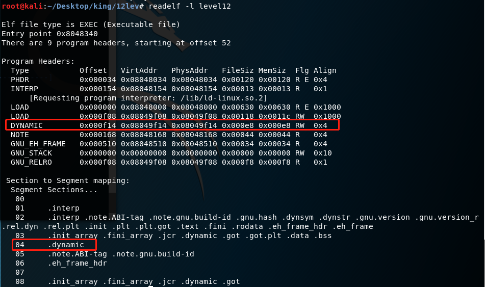

~~困得神志不清， 全靠求生意志死撑~~
我决定先跟着[Return-to-dl-resolve](http://pwn4.fun/2016/11/09/Return-to-dl-resolve/)的思路走一遍

类型为``PT_DYNAMIC``的``段``包含了``.dynamic``节，该段保存了一个由类型为``Elf32_Dyn``的结构体组成的数组，``Elf32_Dyn``的结构如下：

```
typedef struct {
    Elf32_Sword d_tag;
    union {
        Elf32_Word d_val;
        Elf32_Addr d_ptr;
    } d_un;
} Elf32_Dyn;
```

例如在我手头上的程序里，它长这样

动态段在哪可以通过命令readelf查到



----
哔哔几句
1.羡慕逻辑都比我强的普通人类
2.之前都用的图片上传，然后听说有人看不了图片（所以为什么会有人看我的blog阿），然后这篇开始就直接把截图扔到自己博客这里了……我应该早就这样做的 -0-

3.然后这样我编辑的时候又不能及时看了……想了下还是扔自己的服务器上吧……

4.……那我终于有一天缺钱到服务器都养不起了怎么办？
